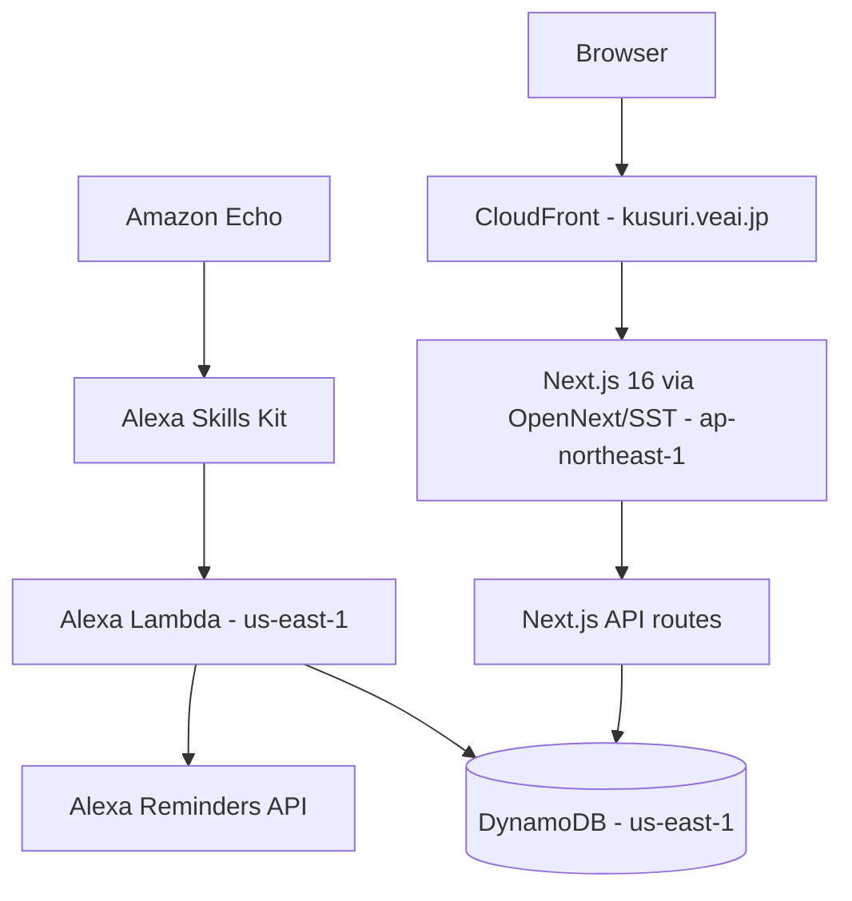

# Medication Promise

Medication Promise (`お薬の約束`) is an in-development medication logging tool for one household. A family member can record five daily medication timings from a web app or by voice through Amazon Alexa, review recent history, change household reminder settings, and export a monthly PDF.

The current production deployment is intentionally limited to one household. It is not a medical device, does not decide whether medication should be taken, and is not yet a multi-household public service.

## Technical Product Management Profile

This project demonstrates end-to-end Technical PM capability in a HealthTech context:

- Translating a lived household problem into personas, outcomes, user stories, and acceptance criteria.
- Making cloud architecture trade-offs across Alexa, Lambda, DynamoDB, Next.js, CloudFront, S3, and multi-region AWS resources.
- Recovering a failed managed-hosting path without losing the working product loop.
- Governing AI-assisted delivery through written scope, human review, CI, and production evidence.
- Treating privacy, healthcare wording, tenant isolation, and operational recovery as release criteria.
- Designing a limited beta that can produce credible research and product evidence without claiming clinical outcomes.

## Product Status

| Capability | Status |
| --- | --- |
| Web recording, correction, history, and monthly PDF | Working household MVP |
| Alexa voice recording and daily reminders | Working household MVP |
| Protected medication name and reminder settings | Deployed household MVP |
| Household-scoped Web data boundary | Deployed; Cognito + membership flow verified in production with synthetic data |
| Versioned JSON export | Implemented, synthetic-contract verified, and deployed for authenticated personal review |
| Household-wide deletion | Implemented and synthetic-isolation verified; production feature flag remains off pending Alexa and recovery gates |
| Weekly report | Deterministic rule-based report is the approved default; the Bedrock prototype path is not approved for use and remains default-off |
| Alexa account linking and household resolution | Prototype code and automated tests; skill configuration and device verification remain |
| Public availability | Not released |

Production app: [kusuri.veai.jp](https://kusuri.veai.jp) (private access required)
Product page: [VEAI LAB - Medication Promise](https://veai.jp/apps/medication-promise/)

## Product Management Evidence

This repository is also a public delivery record for a small, AI-assisted HealthTech project:

- [Live Agile Delivery Project](https://github.com/users/larai-w/projects/9): evidence-backed and planned user stories with delivery status, priority, area, size, and release target.
- [Product management case study](docs/PRODUCT_MANAGEMENT_CASE_STUDY.md): discovery, personas, outcome roadmap, prioritisation, safety decisions, and delivery evidence.
- [Agile delivery method](docs/AGILE_DELIVERY.md): story format, acceptance criteria, Definition of Done, risk controls, and AI-delegation governance.
- [Household identity design](docs/HOUSEHOLD_IDENTITY_DESIGN.md): released Web authentication, DynamoDB partitioning, migration, rollback, and isolation controls.
- [Web Cognito authentication runbook](docs/WEB_COGNITO_AUTH_RUNBOOK.md): PKCE sign-in, membership resolution, production checks, and rollback.
- [Linked Alexa verification runbook](docs/ALEXA_LINKED_DEVICE_VERIFICATION.md): privacy-safe preflight, device checks, evidence template, rollback, and operator handoff for the account-linking release gate.
- [Household data deletion](docs/DATA_DELETION.md): tenant-scoped deletion order, retention/recovery limits, and production activation gates.
- [GitHub Project automation](docs/PROJECT_AUTOMATION.md): labels, milestones, issue backfill, Project fields, and workflow automation.

Historical GitHub issues are explicitly labelled `evidence:backfill`. They were reconstructed from contemporaneous private records, tests, and commits; they are not presented as if GitHub Issues had been used from day one. New work is managed live through issues and pull requests.

## Architecture



- `web/`: Next.js 16 application deployed with OpenNext and SST to CloudFront, Lambda, and S3.
- `alexa/`: Alexa Skills Kit Lambda for voice records and reminder setup.
- DynamoDB: shared record and household settings store.
- GitHub Actions: Web tests/lint/build, Alexa tests/package, Lambda deployment, labeling, and publication-boundary checks.

Architecture decisions are recorded as product decisions, not only implementation notes: [Product management case study](docs/PRODUCT_MANAGEMENT_CASE_STUDY.md#technical-pm-and-cloud-architecture-evidence).

## Web API Routes

| Method | Path | Description |
| --- | --- | --- |
| `GET` | `/api/records?date=YYYY-MM-DD` | Records for one day |
| `GET` | `/api/records?from=YYYY-MM-DD&to=YYYY-MM-DD` | Records for a date range |
| `POST` | `/api/records` | Create a record |
| `PUT` | `/api/records/[id]` | Update a record |
| `DELETE` | `/api/records/[id]` | Delete a record |
| `GET` | `/api/records/pdf?month=YYYY-MM` | Monthly PDF export |
| `GET` | `/api/records/export?from=YYYY-MM-DD&to=YYYY-MM-DD` | Versioned household care-event JSON export |
| `GET` | `/api/settings` | Read household medication and reminder settings |
| `PUT` | `/api/settings` | Update household medication and reminder settings |
| `GET` | `/api/account/data` | Read deletion availability and required acknowledgements |
| `DELETE` | `/api/account/data` | Delete the authenticated household data when the release gate is enabled |

The machine-readable export is documented in
[Versioned Care Event Export](docs/CARE_EVENT_EXPORT.md). It uses synthetic tests,
does not infer missed medication from absent records, and excludes identity,
credentials, medication names, and presentation settings. Daily condition scores are
included as a separate `dailyConditions` collection; they are not silently converted
into medication events.

## Local Verification

```bash
cd web
npm ci
npm test
npm run lint
npm run build

cd ../alexa
npm ci
npm test
npm run zip
```

## Deployment

```bash
cd web
npm run deploy
```

Web production uses SST v4 and OpenNext. The web infrastructure is in `ap-northeast-1`; DynamoDB and the Alexa Lambda are in `us-east-1`.

## Safety Boundary

Medication Promise supports recording and reflection. Medication decisions remain with the person taking the medicine and their qualified healthcare professionals. The access-code path is retained only for controlled rollback. Invited Web access uses Cognito identity plus a server-side household membership lookup; public self-service signup and multi-household switching are not available.

The weekly report does not use Bedrock by default. The repository contains a gated
prototype integration, but model use is not an approved product capability and health
record data must not be sent through that path without a separate privacy, safety,
grounding, retention, and user-consent decision.

## License

MIT License
